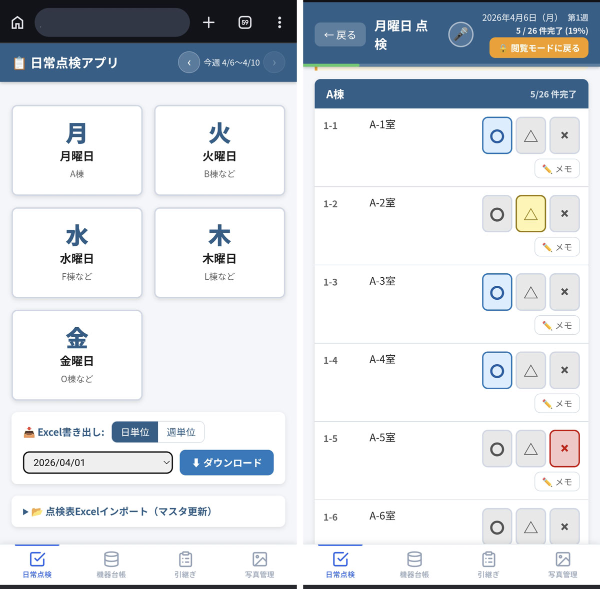

# Daily Inspection App

> **Language:** English | [日本語](README.ja.md)

A daily inspection recording system for water treatment facilities, built with Flask + PWA.
Works in both online and offline environments. Results are saved to both the server (SQLite) and the browser (IndexedDB).

<a href="doc/images/01_tenken_top.JPG"></a>

---

## System Overview

| Item | Details |
|------|---------|
| Backend | Python 3.13 / Flask 3.x |
| Database | SQLite 3 (`tenken.db`) |
| Frontend | Vanilla JS (ES Modules) |
| Offline Support | Service Worker + IndexedDB (PWA) |
| Excel Integration | openpyxl (export & import) |

### Key Features

- **Day-of-week inspection input** — Displays inspection items for each weekday (Mon–Fri); results recorded as ○ / △ / ×
- **Wednesday week-based filtering** — Inspection items switch by week number (Week 1–4)
- **Lead group display** — Auto-displays A/B/C groups and monthly unit numbers
- **Offline operation** — Saves locally when disconnected; auto-syncs on reconnection
- **Excel export** — Writes inspection results for a specified date to an existing `.xlsm` template for download
- **Excel import** — Bulk-updates inspection items from a master Excel sheet
- **Result reset** — Reset results per inspection page, or all results for a date from the top page
- **Voice input** — Hands-free ○ / △ / × entry, item navigation, and memo input via Web Speech API
- **DB sync** — Upload `tenken.db` to a server via the `/sync` settings page; server IP, port, and DB path are configurable and saved persistently

---

## File Structure

```
01_tenken/
├── app.py              # Flask application & REST API routes
├── database.py         # DB initialization, table creation, seed data
├── models.py           # SQLite CRUD functions
├── seed_data.py        # Inspection item master data (initial data)
├── export_excel.py     # Excel export logic
├── import_excel.py     # Excel inspection sheet import logic
├── generate_icons.py   # PWA icon generation script
├── requirements.txt    # Python dependencies
├── start.bat           # Windows launch script
├── start.sh            # Linux / macOS launch script
├── tenken.db           # SQLite database (auto-created on first launch)
├── templates/
│   ├── index.html      # Top page (day selection, export, reset)
│   ├── inspect.html    # Inspection input page
│   └── sync.html       # DB sync settings & execution page
└── static/
    ├── manifest.json   # PWA manifest
    ├── sw.js           # Service Worker (offline cache & sync)
    ├── css/
    │   └── style.css   # Stylesheet
    ├── icons/
    │   ├── icon-192.png
    │   └── icon-512.png
    └── js/
        ├── app.js      # Main JavaScript (inspection logic & sync)
        ├── db.js       # IndexedDB wrapper
        └── voice.js    # Voice recognition engine (Web Speech API wrapper)
```

### Database Tables

| Table | Description |
|-------|-------------|
| `inspection_items` | Inspection item master (day, building, location, week filter, etc.) |
| `senpatu_groups` | Lead group definitions (A/B/C groups, monthly unit numbers) |
| `inspection_results` | Inspection results (unique per item_id + date) |

### REST API

| Method | Path | Description |
|--------|------|-------------|
| GET | `/api/health` | Health check (used for offline detection) |
| GET | `/api/items?day=&week=` | List inspection items for a given day and week |
| GET | `/api/senpatu?day=` | List lead groups for a given day |
| GET | `/api/results?date=` | List inspection results for a given date |
| POST | `/api/results` | Save a single result (UPSERT) |
| POST | `/api/results/batch` | Batch save results (for offline sync) |
| POST | `/api/results/reset` | Delete all results for a given date |
| GET | `/api/export?date=` | Export results for a given date as Excel |
| POST | `/api/import-excel` | Update inspection item master from Excel |
| GET | `/sync` | DB sync settings page |
| GET | `/api/sync/config` | Get current sync configuration |
| POST | `/api/sync/config` | Save sync configuration (server IP/port/DB path) |
| POST | `/api/sync/run` | Execute DB sync (SSE stream for real-time progress) |

---

## Setup

### Requirements

- Python 3.10 or higher
- pip

### Installation

```bash
# Navigate to the project root
cd 01_tenken

# Install dependencies
pip install -r requirements.txt
```

Dependencies:

```
Flask>=3.0.0
openpyxl>=3.1.0
```

---

## Running the App

### Windows

Double-click `start.bat`, or run:

```bat
start.bat
```

### Linux / macOS

```bash
bash start.sh
```

### Direct execution

```bash
python app.py
```

After starting, open `http://localhost:5000` in your browser.

> **Note:** The database file (`tenken.db`) is created automatically on first launch.
> To re-initialize manually, run `python database.py`.

---

## Usage

### Recording Inspections

1. On the top page, tap the **weekday card** for the target day
2. For each inspection item, tap **○ / △ / ×** to enter the result
3. If a note is needed, tap the **✏️ Memo** button to add and save a note
4. Results are saved immediately (offline saves locally; auto-syncs on reconnection)

### Wednesday Week Switching

The Wednesday inspection page shows **week selection buttons** (Week 1–4).
Tap the appropriate week to switch to that week's inspection items.

### Bulk Input

- **✅ No Issues** button: Fills all items with their `result_hint` (standard judgment) at once
- **Reset Results** button: Clears all results on the current page for today

### Excel Export

1. On the top page, select a date under "📥 Export to Excel"
2. Click **⬇ Download** to get the `.xlsm` file

### Inspection Master Import

1. Open "📂 Import Inspection Excel" on the top page
2. Select an `.xlsm` / `.xlsx` file containing a `点検表(マスタ)` sheet
3. Click **▶ Run Import** (overwrites the `inspection_items` table)

### Voice Input

Tap the **🎤 button** in the header of the inspection page to start voice recognition (button pulses red). Tap again to stop.

| Utterance Example | Action |
|------------------|--------|
| "異常なし", "正常", "まる", "良好" | Enter ○ → move to next unfilled item |
| "要注意", "注意", "さんかく" | Enter △ → move to next |
| "異常あり", "異常", "ばつ", "不良" | Enter × → move to next |
| "次", "次へ" | Move to next unfilled item |
| "前", "戻る" | Move to previous item |
| "メモ" | Open memo field |
| "メモ 圧力低下" | Open memo field and enter "圧力低下" |
| "保存" | Save memo |

**Behavior Details**

- The focused row (blue left border) is the current input target. Automatically moves to the first unfilled item on page load
- **Tapping 🎤 announces the current item number and equipment name aloud before starting recognition**
- Recognized text is shown as a toast at the bottom of the screen (✅ = command recognized, ❓ = unrecognized)
- Result input is blocked in past-date view mode (navigation only)
- Auto-stops after 10 seconds of silence
- Button is disabled on devices that do not support Web Speech API

### Full Reset (Admin Operation)

1. At the bottom of the top page, select a date under "🗑 Reset All Results"
2. Click **Reset All Results**
3. Confirm in the dialog → deletes from both the server DB and browser IndexedDB

---

## Installing as a PWA

The app can be installed on mobile and desktop via "Add to Home Screen".

- **Offline support**: The app shell (HTML/CSS/JS) is cached by the Service Worker, so the screen loads even without a network connection
- **Offline recording**: Records are saved to IndexedDB and automatically synced to the server when back online

---

## License

MIT License

Copyright (c) 2024 D. Kawakami

Permission is hereby granted, free of charge, to any person obtaining a copy
of this software and associated documentation files (the "Software"), to deal
in the Software without restriction, including without limitation the rights
to use, copy, modify, merge, publish, distribute, sublicense, and/or sell
copies of the Software, and to permit persons to whom the Software is
furnished to do so, subject to the following conditions:

The above copyright notice and this permission notice shall be included in all
copies or substantial portions of the Software.

THE SOFTWARE IS PROVIDED "AS IS", WITHOUT WARRANTY OF ANY KIND, EXPRESS OR
IMPLIED, INCLUDING BUT NOT LIMITED TO THE WARRANTIES OF MERCHANTABILITY,
FITNESS FOR A PARTICULAR PURPOSE AND NONINFRINGEMENT. IN NO EVENT SHALL THE
AUTHORS OR COPYRIGHT HOLDERS BE LIABLE FOR ANY CLAIM, DAMAGES OR OTHER
LIABILITY, WHETHER IN AN ACTION OF CONTRACT, TORT OR OTHERWISE, ARISING FROM,
OUT OF OR IN CONNECTION WITH THE SOFTWARE OR THE USE OR OTHER DEALINGS IN THE
SOFTWARE.
