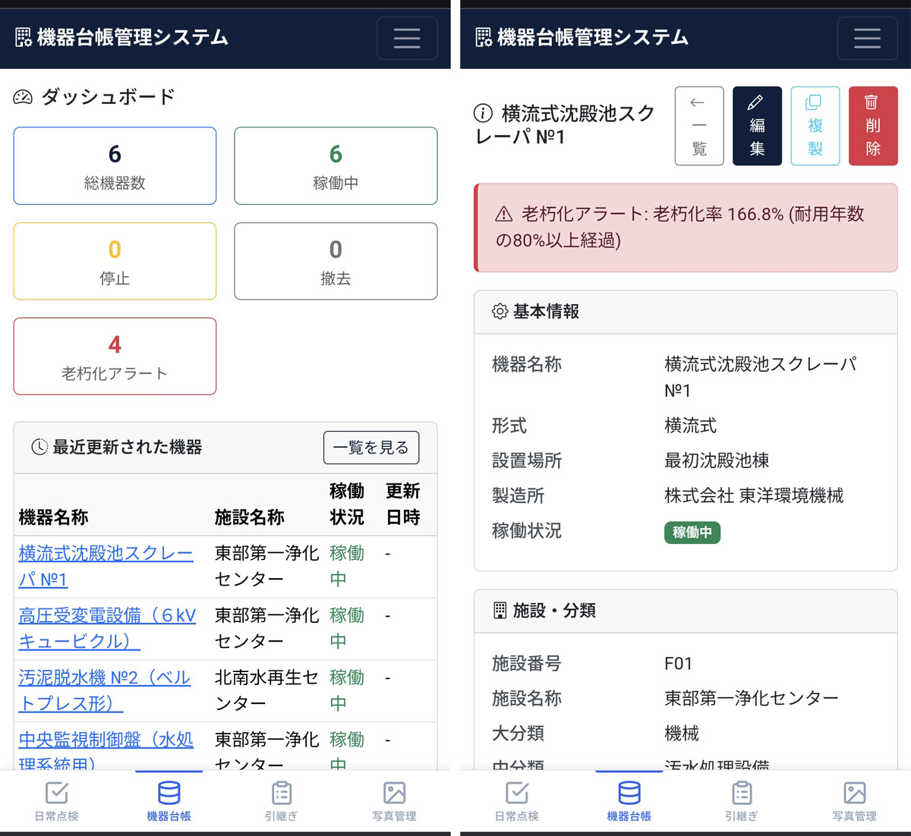

# Equipment Registry Management System

A web application for centralized management of plant equipment information. Built with Flask + SQLite, it supports equipment registration, search, editing, and CSV export from your browser. Database models are anonymized for demo purposes.

[日本語版はこちら / Japanese](README_ja.md)

<a href="doc/images/02_daicho_dashboard.jpg"></a>

## Features

- **Equipment List & Search** — Filter by facility number, facility name, major/middle/minor category, operating status, manufacturer, and more. Supports natural language search with synonyms.
- **Equipment Detail & Edit** — Register, update, delete, and duplicate equipment records.
- **Measurement Management** — Record measurement history for each piece of equipment.
- **CSV Import** — Auto-detects character encoding (Shift-JIS / UTF-8, etc.) on import.
- **CSV Export** — Download filtered results as CSV (UTF-8 with BOM).
- **Dashboard** — Summary of equipment count and operating status, with aging equipment rankings.
- **Autocomplete** — Input suggestions for form fields.

## Tech Stack

| Component | Details |
|-----------|---------|
| Backend | Python 3.x / Flask |
| Database | SQLite (`daicho.db`) |
| Frontend | HTML / CSS / JavaScript (Jinja2 templates) |
| Encoding Detection | chardet |

## Setup

### Requirements

- Python 3.9 or higher

### Installation

```bash
pip install -r requirements.txt
```

### Running the App

**Linux / macOS:**
```bash
./start.sh
```

**Windows:**
```bat
start.bat
```

Or directly:
```bash
python app.py
```

After starting, open `http://localhost:5007` in your browser.

## Initial Data

If the equipment table is empty on startup, the app automatically imports `kikilist.csv` from the same directory.

## Directory Structure

```
02_daicho/
├── app.py              # Flask app & routing
├── models.py           # Data access layer (CRUD / CSV mapping)
├── database.py         # DB connection & schema initialization
├── requirements.txt    # Python dependencies
├── kikilist.csv        # Initial data (equipment list)
├── start.sh            # Startup script (Linux/macOS)
├── start.bat           # Startup script (Windows)
├── static/             # Static files (CSS, etc.)
└── templates/          # Jinja2 templates
```

## API Endpoints

| Method | Path | Description |
|--------|------|-------------|
| GET | `/api/equipment` | List equipment (with filter & pagination) |
| POST | `/api/equipment` | Register new equipment |
| GET | `/api/equipment/:id` | Get single equipment record |
| PUT | `/api/equipment/:id` | Update equipment |
| DELETE | `/api/equipment/:id` | Delete equipment |
| POST | `/api/equipment/:id/duplicate` | Duplicate equipment |
| GET | `/api/equipment/:id/measurements` | List measurements |
| POST | `/api/equipment/:id/measurements` | Register measurement |
| GET | `/api/facilities` | List facilities |
| GET | `/api/categories` | List categories |
| GET | `/api/autocomplete` | Autocomplete suggestions |
| POST | `/api/import/csv` | Import CSV |
| GET | `/api/export/csv` | Export CSV |
| GET | `/api/dashboard/stats` | Dashboard statistics |
