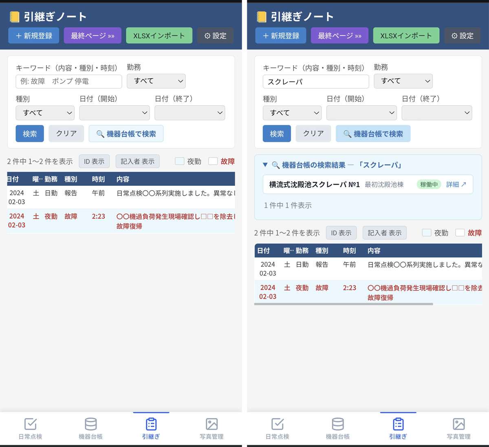

# 引継ぎノート（note2） / Handover Note

施設管理・設備保守向けの引継ぎノート電子化アプリです。  
Flask + SQLite で動作し、Raspberry Pi 5 など低スペック機でも軽快に動きます。

A digital handover note application for facility and equipment management.  
Built with Flask + SQLite; runs smoothly on low-spec devices such as Raspberry Pi 5.

<a href="doc/images/03_note_toppage.JPG"></a>

---

## 機能 / Features

| 機能 | Feature |
|------|---------|
| 引継ぎ記録の一覧・登録・編集・削除 | List, create, edit, and delete handover records |
| 自然言語キーワード検索（同義語展開・関連度順・ハイライト） | Full-text keyword search with synonym expansion, relevance ranking, and highlighting |
| 勤務区分・種別・日付範囲での絞り込み | Filter by shift, category, and date range |
| Excel（.xlsx）からの一括インポート（ファイル選択 / ネットワーク経由） | Bulk import from Excel (.xlsx) via file picker or network |
| **複数エンジン対応の日本語音声読み上げ**（VOICEVOX / Windows SAPI / Termux） | **Japanese TTS with multiple engine support** (VOICEVOX / Windows SAPI / Termux) |
| 読み上げ設定ページ（エンジン切替・フィールド・ラベル ON/OFF・スピーカー変更） | TTS settings page (engine selection, field/label toggles, speaker selection) |
| 音声キャッシュ管理（mediaフォルダ）| Audio cache management (media folder) |
| 夜勤・故障行のカラー表示 | Color-coded rows for night shifts and equipment failures |
| ID列・記入者列の表示切替（localStorage） | Toggle visibility of ID and recorder columns (localStorage) |

---

## 必要環境 / Requirements

| 項目 | バージョン | Item | Version |
|------|-----------|------|---------|
| Python | 3.9 以上 | Python | 3.9+ |
| Flask | 2.x 以上 | Flask | 2.x+ |
| openpyxl | 3.x | openpyxl | 3.x |
| VOICEVOX | 最新版（任意・VOICEVOX エンジン使用時） | VOICEVOX | Latest (optional, required only for VOICEVOX engine) |

```bash
pip install flask openpyxl
```

---

## 起動方法 / Quick Start

### 基本起動 / Basic Start

```bash
cd 06_note2
python app.py
```

ブラウザで `http://localhost:5000` を開く。  
Open `http://localhost:5000` in your browser.

初回起動時、同ディレクトリの `note.xlsx` が存在すれば自動インポートされます。  
On first launch, `note.xlsx` in the same directory is automatically imported if it exists.

---

## 音声読み上げ機能 / Text-to-Speech Feature

3種類の TTS エンジンに対応しています。設定ページでエンジンを切り替えられます。  
Three TTS engines are supported. Switch between them on the settings page.

| エンジン | 対応OS | 追加インストール | 特徴 | Engine | OS | Extra install | Notes |
|---------|--------|--------------|------|--------|-----|---------------|-------|
| **VOICEVOX** | Windows / macOS / Linux | VOICEVOX アプリ | 高品質・複数キャラクター | **VOICEVOX** | Windows / macOS / Linux | VOICEVOX app | High quality, multiple voices |
| **Windows SAPI** | Windows のみ | 不要 | OS 標準音声・追加設定ゼロ | **Windows SAPI** | Windows only | None | Built-in OS voice, zero setup |
| **Termux** | Android (Termux) | termux-api パッケージ | デバイス標準 TTS をそのまま利用 | **Termux** | Android (Termux) | termux-api package | Uses device built-in TTS |

### VOICEVOX エンジン / VOICEVOX Engine

[VOICEVOX](https://voicevox.hiroshiba.jp/) は無料で使える高品質な日本語音声合成ソフトウェアです。  
ローカルで動作するため、インターネット接続不要・API 費用ゼロで利用できます。

[VOICEVOX](https://voicevox.hiroshiba.jp/) is a free, high-quality Japanese text-to-speech software.  
It runs locally — no internet connection or API costs required.

- 公式サイト / Official site: https://voicevox.hiroshiba.jp/
- Windows / macOS / Linux 対応
- 複数のキャラクターボイスを選択可能 / Multiple character voices available

**セットアップ / Setup**

1. **VOICEVOX をインストール・起動する**  
   Install and launch VOICEVOX.  
   起動すると `http://localhost:50021` でローカル API が待機します。  
   Once launched, a local API becomes available at `http://localhost:50021`.

2. **Flask アプリを起動して設定ページでエンジンを「VOICEVOX」に設定する**  
   Start the Flask app and set the engine to "VOICEVOX" on the settings page.

3. **一覧画面で 🔊 ボタンをクリック**  
   Click the 🔊 button on any row in the list.  
   初回は VOICEVOX で音声を生成し `media/` フォルダに保存します（2回目以降はキャッシュを再生）。  
   The first click generates audio via VOICEVOX and saves it to the `media/` folder. Subsequent clicks play the cached file.

### Windows SAPI エンジン / Windows SAPI Engine

Windows 標準搭載の音声合成エンジン（`System.Speech`）を PowerShell 経由で使用します。  
VOICEVOX のインストールが不要で、Windows PC であればすぐに利用できます。

Uses Windows' built-in speech synthesis engine (`System.Speech`) via PowerShell.  
No additional installation required — works out of the box on any Windows PC.

**セットアップ / Setup**

1. 設定ページでエンジンを「**Windows SAPI**」に変更する  
   On the settings page, select **"Windows SAPI"** as the TTS engine.

2. **一覧画面で 🔊 ボタンをクリック**  
   Click the 🔊 button on any row. Audio is generated via PowerShell and cached in `media/`.

> Windows の言語設定で日本語音声パック（Microsoft Haruka 等）がインストールされていると日本語で読み上げられます。  
> Japanese playback requires the Japanese voice pack (e.g. Microsoft Haruka) installed in Windows language settings.

### Termux エンジン / Termux Engine

Android 上の Termux 環境で、`termux-tts-speak` コマンドを使ってデバイスのスピーカーから直接再生します。  
音声ファイルは生成せず、デバイス標準の TTS エンジンをそのまま利用します。

On Android (Termux), uses `termux-tts-speak` to play audio directly through the device speaker.  
No audio file is generated — the device's built-in TTS engine is used directly.

**セットアップ / Setup**

```bash
pkg install termux-api
```

設定ページでエンジンを「**Termux**」に変更する。  
On the settings page, select **"Termux"** as the TTS engine.

---

### 読み上げ内容 / What Gets Read

各レコードの以下のフィールドを順番に読み上げます（設定で変更可）:

The following fields are read aloud in order (configurable in settings):

```
2024年5月17日、金曜日。夜勤。種別、報告。時刻、午前。内容。〇〇〇〇〇
```

### 読み上げ設定 / TTS Settings

ヘッダー右上の「⚙ 読み上げ設定」から設定ページへアクセスできます。  
Access the settings page via "⚙ 読み上げ設定" in the top-right header.

| 設定項目 | 説明 | Setting | Description |
|---------|------|---------|-------------|
| TTS エンジン | voicevox / windows_sapi / termux から選択 | TTS Engine | Select from voicevox / windows_sapi / termux |
| 読み手（スピーカー） | VOICEVOX のキャラクター・スタイルを選択（VOICEVOX エンジン時のみ有効） | Speaker | Select VOICEVOX character and style (VOICEVOX engine only) |
| 日付・曜日・勤務・種別・時刻・内容 | 各フィールドの読み上げ ON/OFF | Fields | Toggle each field on/off |
| 項目名（ラベル）を読む | 「種別、」「時刻、」などの前置きを読む/読まない | Labels | Toggle field name prefixes (e.g. "種別、") |

設定は SQLite DB に保存され、サーバー再起動後も維持されます。  
Settings are stored in the SQLite DB and persist across server restarts.

### 音声キャッシュ管理 / Audio Cache Management

設定ページ下部の「音声キャッシュ管理」セクションで `media/` フォルダ内の WAV ファイルを管理できます。

The "音声キャッシュ管理" section at the bottom of the settings page manages WAV files in the `media/` folder.

- ファイル数・合計サイズの確認 / View file count and total size
- 全件一括削除 / Delete all files at once
- 個別ファイルの削除 / Delete individual files

---

## 検索機能の詳細 / Search Details

### キーワード検索 / Keyword Search

スペース区切りで複数語を入力すると **AND 検索** になります。  
`naiyou`（内容）・`jikoku`（時刻）・`shubetsu`（種別）の3フィールドを横断検索します。

Multiple space-separated terms perform **AND search** across the `naiyou`, `jikoku`, and `shubetsu` fields.

```
例: ポンプ 故障       → ポンプ AND 故障（関連語含む）
    停電 復旧         → 停電 AND 復旧（同義語も検索）
```

### 同義語展開 / Synonym Expansion

| 入力 | 展開される語 |
|------|-------------|
| 故障 | 故障・トラブル・不具合・障害・異常 |
| エラー | エラー・アラーム・警報・アラート |
| 停電 | 停電・電源断・復電・停電復旧・停電発生 |
| 点検 | 点検・チェック・巡視・巡回・検査 |
| 漏水 | 漏水・水漏れ・漏れ |
| 修理 | 修理・修繕・補修・修復 |
| 復旧 | 復旧・回復・復帰・正常復帰 |

`app.py` の `SYNONYM_GROUPS` に施設固有の用語を追加できます。  
Add facility-specific terms to `SYNONYM_GROUPS` in `app.py`.

---

## データベース / Database

SQLite（`note.db`）を使用。起動時に自動生成されます。  
Uses SQLite (`note.db`), created automatically on first launch.

### notes テーブル / notes table

| カラム | 型 | 説明 | Description |
|--------|-----|------|-------------|
| id | INTEGER | 主キー（自動採番） | Primary key (auto-increment) |
| date | TEXT | 日付（YYYY-MM-DD） | Date (YYYY-MM-DD) |
| kinmu | TEXT | 勤務区分（日勤・夜勤 等） | Shift type (day/night, etc.) |
| shubetsu | TEXT | 種別（報告・故障・処置 等） | Category (report, failure, etc.) |
| jikoku | TEXT | 時刻・時間帯 | Time or time slot |
| naiyou | TEXT | 内容（本文） | Content (main text) |
| kinyugsha | TEXT | 記入者 | Recorder name |

### settings テーブル / settings table

読み上げ設定を key-value 形式で保存します。  
Stores TTS settings as key-value pairs.

| key | デフォルト | 説明 |
|-----|-----------|------|
| tts_engine | voicevox | TTS エンジン（voicevox / windows_sapi / termux） |
| voicevox_speaker | 13 | スピーカーID（青山龍星）※VOICEVOX エンジン時のみ使用 |
| read_date | 1 | 日付を読む |
| read_youbi | 1 | 曜日を読む |
| read_kinmu | 1 | 勤務を読む |
| read_shubetsu | 1 | 種別を読む |
| read_jikoku | 1 | 時刻を読む |
| read_naiyou | 1 | 内容を読む |
| read_labels | 1 | 項目名ラベルを読む |

---

## Excel インポート / Excel Import

### ファイル選択インポート / File Picker Import

ヘッダー右上の「XLSXインポート」ボタンからファイルを選択すると即時インポートされます。  
Click "XLSXインポート" in the header to import a file immediately.

### ネットワーク経由インポート / Network Import

ヘッダー右上の「🌐 ネットから」ボタンからネットワーク上のサーバーの xlsx を取り込めます。  
Click "🌐 ネットから" to import xlsx files from a server on the network.

[media-kanri](https://github.com/d-kawakami/media-kanri) と連携する場合は `http://サーバーIP:5004/api/files` を入力してください。  
When using with media-kanri, enter `http://<server-ip>:5004/api/files`.

### 列マッピング / Column Mapping

| 項目 | 内容 |
|------|------|
| 対象シート | 先頭シート |
| 読込開始行 | 3行目から |
| A列 | 空欄 |
| B列 | 故障フラグ（スキップ） |
| C列 | 記入年月日（日付） |
| D列 | 曜日（数式、スキップ） |
| E列 | 勤務 |
| F列 | 種別 |
| G列 | 時刻 |
| H列 | 内容 |
| I列 | 記入者 |
| 重複チェック | (日付, 勤務, 時刻, 内容) の組み合わせで判定 |

---

## ファイル構成 / File Structure

```
06_note2/
├── app.py              # Flask アプリ本体
├── note.db             # SQLite データベース（自動生成、git除外）
├── note.xlsx           # インポート元 Excel（git除外）
├── .env                # VOICEVOX 設定（git除外）
├── media/              # 生成音声キャッシュ（.wav、git除外）
├── README.md           # このファイル
└── templates/
    ├── index.html      # 一覧・検索画面
    ├── form.html       # 登録・編集フォーム
    └── settings.html   # 読み上げ設定画面
```

---

## 設定ファイル / Configuration

`.env` ファイルで VOICEVOX の接続先とデフォルトスピーカーを変更できます（VOICEVOX エンジン使用時のみ参照）。  
The `.env` file configures the VOICEVOX connection and default speaker (used only when the VOICEVOX engine is selected).

```env
# VOICEVOX ローカルAPIのURL（デフォルト: http://localhost:50021）
VOICEVOX_URL=http://localhost:50021

# デフォルトスピーカーID（設定ページで変更可）
# 1=四国めたん  3=ずんだもん  8=春日部つむぎ  13=青山龍星  16=九州そら
VOICEVOX_SPEAKER=13
```

TTS エンジンの切り替えは `.env` ではなく、アプリの **設定ページ**（⚙ 読み上げ設定）から行います。  
The TTS engine is selected from the app's **settings page** (⚙ 読み上げ設定), not the `.env` file.

---

## パフォーマンス目安 / Performance (Raspberry Pi 5)

| 操作 | 応答時間 |
|------|---------|
| 一覧表示（フィルタなし） | < 50 ms |
| キーワード検索（数千件） | < 200 ms |
| 音声生成（VOICEVOX、初回） | 1〜3 秒 |
| 音声生成（Windows SAPI、初回） | 2〜5 秒 |
| 音声再生（キャッシュ済み） | 即時 |
| 音声再生（Termux、デバイス直接） | 即時〜1 秒 |
