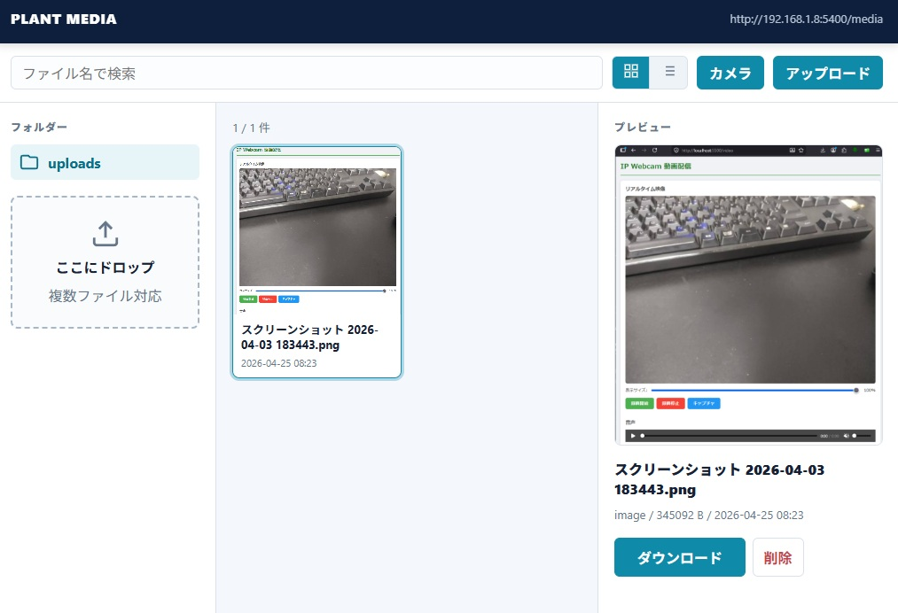

# メディア管理

スマートフォンから現場の写真・動画を転送・閲覧するための軽量Webアプリです。

[English version here / English](README.md)



---

## 機能

- **ファイル転送**
  - スマートフォンからカメラ撮影・ファイル選択
  - ドラッグ＆ドロップ対応
  - 複数ファイル同時転送・進捗バー表示
  - 他アプリからのアップロード用APIエンドポイント（CORS対応）

- **ファイル一覧**
  - サムネイルグリッド表示
  - ファイル名リスト表示
  - 画像（JPG, PNG, GIF, BMP, WebP）・動画（MP4, MOV, AVI, WebM, M4V）・その他すべてのファイル形式に対応

- **ダウンロード**
  - クライアント端末からの直接ダウンロード

- **削除**
  - 確認ダイアログ付きでファイル削除

- **メディアビューア**
  - フルスクリーンの画像・動画ビューア（ダウンロードボタン付き）

---

## システム構成

```
スマートフォン（クライアント）
      |
   Wi-Fi AP (hostapd)
      |
   nginx (ポート80)  ←→  Flaskアプリ (ポート5004)
      |
   dnsmasq (DHCP)
```

| コンポーネント | 役割                          |
|--------------|-------------------------------|
| hostapd      | Wi-Fiアクセスポイント           |
| dnsmasq      | DHCPサーバー                  |
| nginx        | リバースプロキシ（ポート80）     |
| Flask        | Webアプリケーション（ポート5004）|

---

## 動作要件

- Python 3.10+
- Flask
- Nginx
- hostapd
- dnsmasq

---

## セットアップ

### 1. リポジトリをクローン

```bash
git clone https://github.com/d-kawakami/media-kanri.git
cd media-kanri
```

### 2. 仮想環境を作成

```bash
python3 -m venv venv
source venv/bin/activate
pip install flask
```

### 3. nginx設定

```nginx
server {
    listen 80;
    server_name _;

    location / {
        proxy_pass http://127.0.0.1:5004;
        proxy_set_header Host $host;
        proxy_set_header X-Real-IP $remote_addr;
    }
}
```

### 4. systemdサービス設定

```ini
[Unit]
Description=Plant Media Web App
After=network.target

[Service]
User=www-data
WorkingDirectory=/opt/webapp
ExecStart=/opt/webapp/venv/bin/python3 app.py
Restart=always

[Install]
WantedBy=multi-user.target
```

```bash
sudo systemctl enable webapp
sudo systemctl start webapp
```

### 5. アップロードフォルダの権限設定

```bash
sudo chown www-data /opt/webapp/uploads
```

---

## アクセス方法

スマートフォンをWi-FiのAPに接続し、以下のURLにアクセスしてください。

| ページ   | URL                          |
|---------|------------------------------|
| メディア管理 | `http://192.168.1.250/media` |

> `192.168.1.250` はAPインターフェースのIPアドレスに合わせて変更してください。

> **注意:** 上記URLはnginxがポート80のリバースプロキシとして動作している場合のものです。
> nginxを使わずFlaskに直接アクセスする場合は `:5004` を付けてください（例：`http://192.168.1.250:5004/media`）。

---

## ディレクトリ構成

```
/opt/webapp/
├── app.py              # Flaskアプリケーション
├── README.md
├── README.ja.md        # 日本語版README
├── doc/                # ドキュメントとセットアップガイド
├── uploads/            # アップロードされたファイル（www-dataが書き込み可能）
├── templates/
│   └── media.html      # 統合メディア管理画面
└── venv/
```

---

## ライセンス

MIT License
