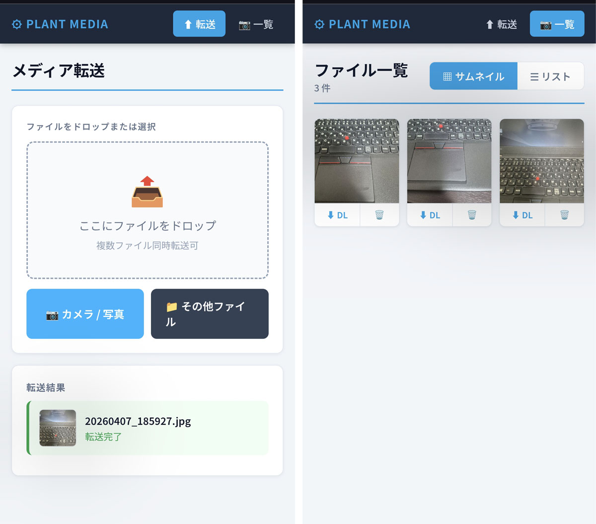

# Media Manager

A lightweight web application for transferring and browsing photos and videos captured on-site at industrial facilities.

This project is designed to run on an old PC (such as a 10-year-old ThinkPad), making it possible to build a functional server at minimal cost — no new hardware required.

[日本語版はこちら / 日本語](README.ja.md)

**Server Setup Guide:** [ThinkPad X260 Server Setup](doc/X260-HomeServer-Setup-EN.md)



---

## Features

- **File Upload**
  - Camera capture and file selection from smartphone
  - Drag & drop support
  - Multi-file simultaneous upload with progress bar

- **File Browser**
  - Thumbnail grid view
  - Filename list view
  - Supports images (JPG, PNG, GIF), videos (MP4, MOV, AVI, WebM), and any other file types

- **Download**
  - Direct download of any file from client devices

- **Delete**
  - Delete files with confirmation dialog

- **Media Viewer**
  - Full-screen image/video viewer with download button

---

## System Architecture

```
Smartphone (Client)
      |
   Wi-Fi AP (hostapd)
      |
   nginx (port 80)  ←→  Flask app (port 5400)
      |
   dnsmasq (DHCP)
```

| Component   | Role                        |
|-------------|-----------------------------|
| hostapd     | Wi-Fi Access Point          |
| dnsmasq     | DHCP server                 |
| nginx       | Reverse proxy (port 80)     |
| Flask       | Web application (port 5400) |

---

## Requirements

- Python 3.10+
- Flask
- Nginx
- hostapd
- dnsmasq

---

## Setup

### 1. Clone the repository

```bash
git clone https://github.com/d-kawakami/media-kanri.git
cd media-kanri
```

### 2. Create virtual environment

```bash
python3 -m venv venv
source venv/bin/activate
pip install flask
```

### 3. Configure nginx

```nginx
server {
    listen 80;
    server_name _;

    location / {
        proxy_pass http://127.0.0.1:5400;
        proxy_set_header Host $host;
        proxy_set_header X-Real-IP $remote_addr;
    }
}
```

### 4. Configure systemd service

```ini
[Unit]
Description=Plant Media Web App
After=network.target

[Service]
User=www-data
WorkingDirectory=/opt/webapp
ExecStart=/opt/webapp/venv/bin/python3 app.py
Restart=always

[Install]
WantedBy=multi-user.target
```

```bash
sudo systemctl enable webapp
sudo systemctl start webapp
```

### 5. Set upload folder permissions

```bash
sudo chown www-data /opt/webapp/uploads
```

---

## Access

Connect your smartphone to the Wi-Fi AP, then open:

| Page      | URL                          |
|-----------|------------------------------|
| Upload    | `http://192.168.1.250/photo` |
| File list | `http://192.168.1.250/list`  |

> Replace `192.168.1.250` with the IP address of your AP interface.

> **Note:** The URLs above assume nginx is running as a reverse proxy on port 80 (the default HTTP port).
> If you access Flask directly without nginx, append `:5400` to the URL (e.g., `http://192.168.1.250:5400/photo`).

---

## Directory Structure

```
/opt/webapp/
├── app.py              # Flask application
├── README.md
├── uploads/            # Uploaded files (www-data writable)
├── static/
├── templates/
│   ├── index.html      # Upload page
│   ├── list.html       # File browser
│   └── image.html      # Media viewer
└── venv/
```

---

## License

MIT License
